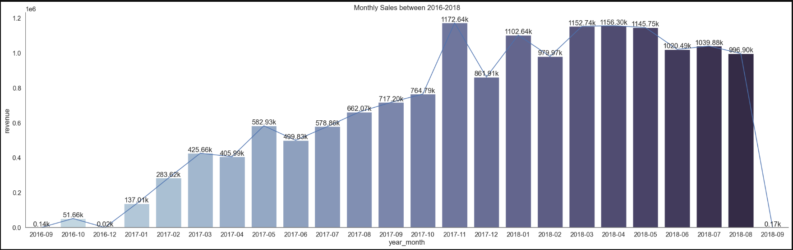
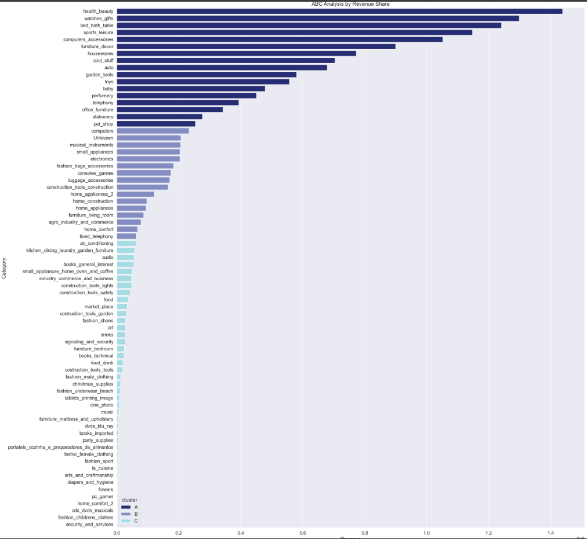
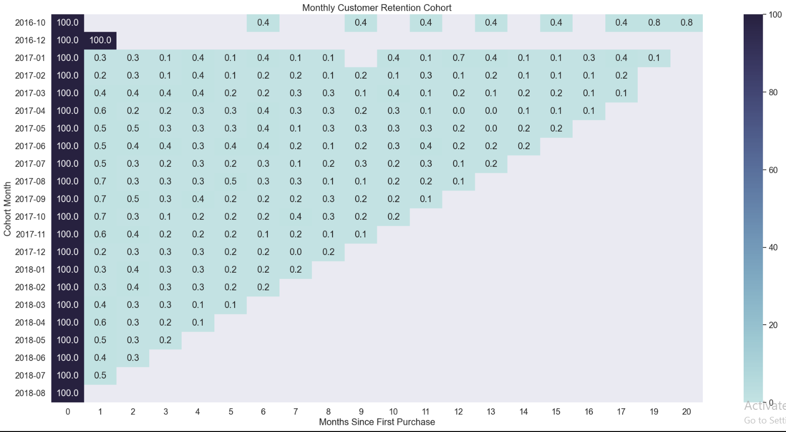
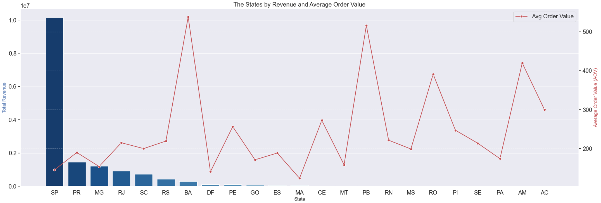
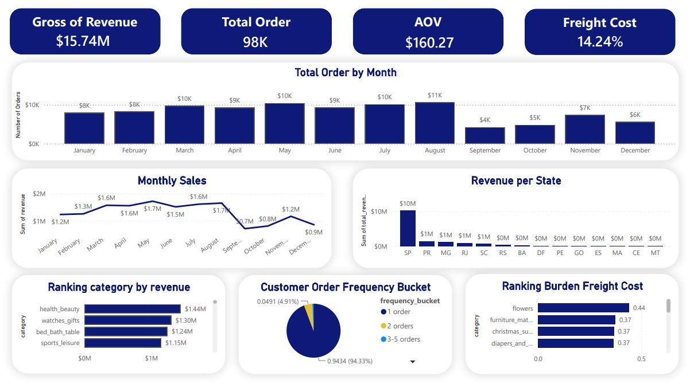

# 🎀 Olist E-commerce data analysis workflow

Conducted an end-to-end analysis of **The Olist Brazilian E-Commerce** dataset — Starting from understanding the business and defining analytical questions to assessing data quality, analyzing key business metrics, validating hypotheses, visualizing trends, building interactive dashboards, and delivering actionable business insights.

**The pipeline:** Downloaded the dataset from Kaggle → Imported the data into **PostgreSQL** → Performed data quality checks and business analysis using **SQL** → Used **Python (Pandas, Matplotlib, Seaborn)** for exploratory analysis and trend visualization → Built interactive dashboards in **Power BI** → Summarized findings and provided **business insights.**

# 📌 Dataset

🔗 **Dataset link:** [Brazilian E-Commerce Public Dataset by Olist](https://www.kaggle.com/datasets/olistbr/brazilian-ecommerce)

The dataset has information of 100k orders from 2016 to 2018 made at multiple marketplaces in Brazil. Its features allows viewing an order from multiple dimensions: from order status, price, payment and freight performance to customer location, product attributes and finally reviews written by customers.

**Attention**

- An order might have multiple items.
- Each item might be fulfilled by a distinct seller.

<!--  -->
<div style="max-width: 80%; margin: 0 auto"></div>

# 📂 Repository Structure

```
├── Insights/
|   ├── business_insight.md
├── Notebooks/
|   ├── data-analysis/
|   |   ├── aov-by-category.csv
|   |   ├── aov-by-customer-segment.csv
|   |   ├── aov-by-month.csv
|   |   ├── category-growth-over-time.csv
|   |   ├── customer-order-frequency-buckets.csv
|   |   ├── customer-type-over-time.csv
|   |   ├── final-ecommerce-dataset.csv
|   |   ├── olist_order_review_dataset.csv
|   |   ├── product_category_name_translation.csv
|   |   ├── retention-category-rate.csv
|   |   ├── revenue-by-category.csv
|   |   ├── revenue-by-customer-segment.csv
|   |   ├── revenue-by-month.csv
|   |   ├── revenue-per-state.csv
|   |   └── top-seller-of-review-delivery.csv
|   ├── Analyst.ipynb
├── Power BI/
│   ├── dashboard.pbix
├── SQL/
│   ├── 01_data_quality.sql
│   ├── 02_kpi_definition.sql
│   ├── 03_revenue_trend_analysis.sql
│   ├── 04_category_analysis.sql
│   ├── 05_customer_analysis.sql
|   └── 06_seller_analysis.sql
├── data/
│   ├── olist_customers_dataset.csv
│   ├── olist_geolocation_dataset.csv
│   ├── olist_order_items_dataset.csv
│   ├── olist_order_payments_dataset.csv
│   ├── olist_order_reviews_dataset.csv
│   ├── olist_orders_dataset.csv
│   ├── olist_products_dataset.csv
│   ├── olist_sellers_dataset.csv
|   └── product_category_name_translation.csv
└── README.md
```

# 🔧 Tools & Tech Stack

| Stage               | Tools                                                                                            |
| ------------------- | ------------------------------------------------------------------------------------------------ |
| Data Cleaning & EDA | Python, Pandas, NumPy, Matplotlib, Seaborn                                                       |
| Database & Analysis | PostgreSQL, SQL (window functions: `DENSE_RANK`, `LAG`, `NTILE`, `RANK`, `JOIN` ,running totals) |
| Dashboard           | Power BI                                                                                         |
| Reporting           | Executive Insights Report (PDF)                                                                  |

# 🧹 Data cleaning

- Removed duplicate records from raw datasets
- Handled missing values in product categories, review fields using appropriate business rules.
- Converted order-related timestamp columns to datetime format.
- Standardized product category names using the category translation dataset.
- Aggregated payment and review data at the order level before joining to prevent duplicated records and inflated metrics.
- Deduplicated and aggregated geolocation data by ZIP code prefix to obtain representative coordinates.
- Validated data types, missing values, and key business metrics before downstream analysis.
- Created a cleaned and integrated dataset for SQL analysis, Pandas exploratory analysis, and Power BI visualization.

# 📊 Exploratory Data Analysis

Create 4 **exploratory data analysis (EDA)** visualizations using Matplotlib and Seaborn, including **monthly revenue trends, ABC analysis of product categories, customer retention rates, and regional revenue alongside Average Order Value (AOV) be state.**

<div style="max-width: 80%; margin: 0 auto;">
    <div></div>
    <div style="display: flex; justify-content: space-between; align-items: center; gap: 15px" >
        <div></div>
        <div></div>
    </div>
    <div></div>
</div>

# 📚 SQL Analysis

The SQL queries were designed to answer key business questions, calculate business metrics, and generate datasets for Power BI dashboards and Pandas analysis:

- Total revenue, monthly revenue, revenue by customer segment, and revenue by state — all calculated using the same revenue formula — `SUM(price + freight_value)`
- Overall Average Order Value (AOV), monthly AOV, and AOV by customer segment — calculated based on `price + freight_value`
- Repeat purchase rate by product category and ranking of product categories by freight cost percentage using `JOIN` and `RANK()`
- Top 5 customers by revenue contribution, customer purchase frequency, and new customer acquisition using `CASE WHEN` and `DATE_TRUNC()`
- Seller distribution across states and seller revenue contribution using **window functions**.

# 📈 Power BI \_ Dashboard

Page Dashboard - Overview Revenue built on SQL query exports.

KPIs: Gross of Revenue $15.74M, Total Order 98K, AOV $160.27, Freight Cost 14.24%

Visuals: Total Order by Month, Monthly Sales, Revenue per State, Ranking category by revenue, Customer Order Frequency Bucket, Ranking burden Freight Cost.

<div style="max-width: 80%; margin: 0 auto"></div>

# ✨ Key insights

### Revenue

Over the **23-month** period from September 2016 to September 2018, the business generated **15.74M in total revenue** from **98,206 orders**, with an **average order value (AOV) of 160**

Revenue experienced a significant surge and reached its highest level in November 2017, generating more than **$1.17M.** This spike was likely driven by the Black Friday shopping season, a well-know seasonal sales event.

Following this peak, revenue growth began to stabilize and show a slight downward trend starting in March 2018, suggesting that the business entered a more mature stage after its rapid growth period.

Finally, revenue dropped sharply in September 2018. This decline should not be interpreted as a deterioration in business performance, as it is caused by the dataset ending during that month, resulting in incomplete data.

### Category

An **ABC Analysis** was conducted to identify the product categories, generating **approximately $12.5M**, which accounts for nearly **80% of total revenue**. These categories mainly include **Health & Beauty, Sports & Leisure, Home & Living,** and other high-performing products. A positive finding is that all Category A products have **freight costs below the platform's average freight burden of 29.04% of product value**, indicating that these categories not only generate strong revenue but also maintain relatively efficient logistics costs.

In contrast, **Category C** generated only **$823,894**, contributing approximately **5% of total revenue**. These categories consist of products with relatively low revenue contribution and low sales volume. Combined with freight burden analysis, several categories such as **Flowers, Furniture/Mattress & Upholstery, and Christmas Supplies** exhibit disproportionately high shipping costs relative to their revenue. Therefore, the business may consider reducing investment, limiting inventory, or even discontinuing some of these product categories to optimize operational costs and improve overall profitability.

### Geographic Distribution of Sellers

The top five seller regions are **São Paulo (SP), Paraná (PR), Minas Gerais (MG), Santa Catarina (SC), and Rio de Janeiro (RJ)**. A common characteristic of these regions is their close proximity to Olist's headquarters in **São Paulo (SP)**.

This geographic concentration allows sellers to take better advantage of Olist's logistics infrastructure, contributing to more efficient operations and faster deliveries. However, it also creates a degree of **geographic dependency**. Any major disruption to the logistics network or operations in the São Paulo (SP) could have a significant impact on the business, as a large proportion of sellers rely on the same operational hub.

🌖 **Author**

**Dao Nguyet Minh**
